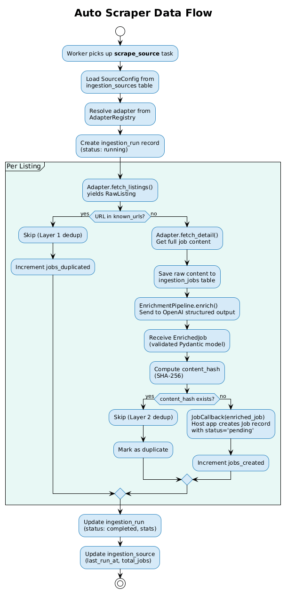

# ijobs-scraper

Job scraping & AI enrichment engine for African job markets.

[](https://pypi.org/project/ijobs-scraper/)
[](https://github.com/mrrobotke/ijobs-scraper/actions/workflows/ci.yml)
[](https://pypi.org/project/ijobs-scraper/)
[](https://opensource.org/licenses/MIT)
[](https://pypi.org/project/ijobs-scraper/)

## Features

- **13 built-in adapters** covering Kenyan job portals — API, HTML, and browser-based sources
- **AI enrichment** via OpenAI structured outputs — extracts titles, skills, salary, categories, and more from raw listings
- **3-layer deduplication** — source URL uniqueness, SHA-256 content hashing, and optional fuzzy matching
- **Async-first** — all I/O uses `async`/`await` with `httpx` for HTTP and `playwright` for browser automation
- **Framework-agnostic** — zero coupling to FastAPI, Django, or any web framework. Integrate anywhere via Protocol-based dependency injection
- **Type-safe** — Pydantic v2 models throughout, passes `mypy --strict`
- **Cron scheduling** — built-in schedule evaluation via `croniter`. Your app decides when and how to enqueue
- **Open-source** — MIT licensed, designed for contributors to add new portal adapters in ~50 lines of code

## Quick Start

```bash
pip install ijobs-scraper
```

```python
import asyncio
from ijobs_scraper import ScraperEngine, SourceConfig, SourceType


class StubAIProvider:
    """Minimal AI provider for testing — returns mock enriched data."""

    async def structured_extract(self, system_prompt, user_prompt, json_schema):
        return {
            "title": "Software Engineer",
            "description": "A great role.",
            "company_name": "One Acre Fund",
            "company_website": None,
            "location": "Nairobi, Kenya",
            "remote_type": "hybrid",
            "employment_type": "full_time",
            "experience_level": "Mid-level",
            "salary_min": None,
            "salary_max": None,
            "currency": "KES",
            "skills": ["Python", "SQL"],
            "benefits": [],
            "category": "technology-engineering",
            "requirements": None,
            "posted_at": None,
            "expires_at": None,
        }


async def main():
    engine = ScraperEngine(ai_provider=StubAIProvider())
    source = SourceConfig(
        name="One Acre Fund",
        slug="one-acre-fund",
        adapter="greenhouse",
        source_type=SourceType.API,
        base_url="https://boards-api.greenhouse.io",
        config={"board_token": "oneacrefund"},
    )
    result = await engine.scrape_source(source)
    print(f"Found: {result.jobs_found} | Created: {result.jobs_created} | Duplicates: {result.jobs_duplicated}")


asyncio.run(main())
```

## Supported Sources

| Source | Adapter | Type | Reusable | Status |
|--------|---------|------|----------|--------|
| Kenya Airways | `kenya_airways` | API | No | Stable |
| One Acre Fund | `greenhouse` | API | Yes | Stable |
| Amref Health Africa | `smartrecruiters` | API | Yes | Stable |
| Careerjet Kenya | `careerjet` | API | Yes | Stable |
| ReliefWeb | `reliefweb` | API | No | Stable |
| BrighterMonday | `brightermonday` | HTML | No | Stable |
| MyJobMag Kenya | `myjobmag` | HTML | No | Stable |
| MyGov Kenya | `mygov` | HTML | No | Stable |
| Fuzu Kenya | `fuzu` | HTML | No | Stable |
| KCB Bank | `kcb` | HTML | No | Stable |
| Absa Bank | `workday` | API | Yes | Stable |
| NCBA Bank | `ncba` | HTML | No | Stable |
| Impactpool | `impactpool` | HTML | No | Stable |
| World Vision | `world_vision` | Browser | No | Stable |

> **14 sources, 14 adapters** — platform adapters such as Workday remain reusable
> across employers by changing their source configuration.

**Reusable** adapters work with any employer on the same platform. For example, the `greenhouse` adapter works for any company using Greenhouse by changing the `board_token` config.

## How It Works

The scraping pipeline follows a linear flow:

```
Source → Adapter → RawListing → AI Enrichment → Dedup → EnrichedJob
```

1. The **Adapter** fetches raw job listings from a portal (via REST API, HTML parsing, or browser automation)
2. The **Enrichment Pipeline** sends raw content to your AI provider with a strict JSON schema, producing structured job data
3. The **Dedup Engine** checks for duplicates across three layers: source URL uniqueness, SHA-256 content hashing, and optional fuzzy matching
4. The **Engine** emits each unique `EnrichedJob` through your callback



See the [full architecture doc](docs/scraper-engine.md) for detailed diagrams and specifications.

## Architecture

`ijobs-scraper` uses **Protocol-based dependency injection** to stay completely decoupled from any framework. Your application provides three interfaces:

- **`AIProvider`** — wraps your OpenAI (or any LLM) calls for structured extraction
- **`StorageBackend`** — provides persistence for deduplication (known URLs, content hashes)
- **`JobCallback`** — handles each enriched job (save to DB, send notification, index for search)

The **Adapter Registry** maps adapter names to classes and auto-detects adapters from URLs for manual scraping. Each adapter is a self-contained class registered via decorator.

For the complete architecture specification, see [docs/scraper-engine.md](docs/scraper-engine.md).

## Usage Examples

### 1. Auto-scrape a source

```python
import asyncio
from ijobs_scraper import ScraperEngine, SourceConfig, SourceType

engine = ScraperEngine(ai_provider=my_ai_provider, storage=my_storage, on_job=my_callback)

source = SourceConfig(
    name="Amref Health Africa",
    slug="amref",
    adapter="smartrecruiters",
    source_type=SourceType.API,
    base_url="https://api.smartrecruiters.com/v1/companies/AmrefHealthAfrica4",
    config={"company_slug": "AmrefHealthAfrica4"},
)

result = asyncio.run(engine.scrape_source(source))
print(f"Status: {result.status} | Created: {result.jobs_created}")
```

### 2. Parse a single URL

```python
import asyncio
from ijobs_scraper import ScraperEngine

engine = ScraperEngine(ai_provider=my_ai_provider)

# Auto-detects the adapter from the URL domain
job = asyncio.run(engine.parse_url("https://boards.greenhouse.io/oneacrefund/jobs/12345"))
print(f"{job.title} at {job.company_name} — {job.location}")
```

### 3. Integrate with FastAPI

```python
from fastapi import FastAPI, HTTPException
from pydantic import BaseModel
from ijobs_scraper import ScraperEngine, EnrichedJob

app = FastAPI()
engine = ScraperEngine(ai_provider=my_ai_provider)


class ParseRequest(BaseModel):
    url: str
    hint: str | None = None


@app.post("/scraper/parse-url", response_model=EnrichedJob)
async def parse_url(request: ParseRequest):
    try:
        return await engine.parse_url(request.url, hint=request.hint)
    except Exception as e:
        raise HTTPException(status_code=422, detail=str(e))
```

## Adding an Adapter

Adding support for a new job portal takes ~50 lines of code:

1. **Create** the adapter file in the correct directory (`api/`, `html/`, or `browser/`)
2. **Subclass** the right base: `APIAdapter`, `HTMLAdapter`, or `BrowserAdapter`
3. **Implement** `fetch_listings()` and `can_handle_url()`
4. **Register** with `@AdapterRegistry.register("your_adapter")`
5. **Add tests** in `tests/adapters/`

```python
from ijobs_scraper.adapters.base import APIAdapter
from ijobs_scraper._registry import AdapterRegistry
from ijobs_scraper.models import RawListing, SourceConfig


@AdapterRegistry.register("my_portal")
class MyPortalAdapter(APIAdapter):
    async def fetch_listings(self, config: SourceConfig):
        data = await self._get(f"{config.base_url}/jobs")
        for item in data["results"]:
            yield RawListing(
                external_id=str(item["id"]),
                external_url=item["url"],
                title=item.get("title"),
                raw_json=item,
                company_name=config.name,
            )

    def can_handle_url(self, url: str) -> bool:
        return "myportal.com" in url
```

See the [full adapter guide](CONTRIBUTING.md#adding-a-new-adapter) and [docs/adding-an-adapter.md](docs/adding-an-adapter.md) for detailed instructions.

## Configuration

### SourceConfig

| Field | Type | Description |
|-------|------|-------------|
| `name` | `str` | Human-readable source name (e.g., "Kenya Airways") |
| `slug` | `str` | URL-safe identifier (e.g., "kenya-airways") |
| `adapter` | `str` | Registered adapter name (e.g., "greenhouse") |
| `source_type` | `SourceType` | One of: `api`, `html`, `browser`, `rss` |
| `base_url` | `str` | Base URL for the source |
| `cron_schedule` | `str \| None` | Cron expression for auto-scraping (e.g., `"0 */6 * * *"`) |
| `is_active` | `bool` | Whether this source is enabled (default: `True`) |
| `config` | `dict` | Adapter-specific configuration (see below) |

### Adapter-specific config examples

```python
# Greenhouse — any employer using Greenhouse
SourceConfig(
    adapter="greenhouse",
    config={"board_token": "oneacrefund"},
    ...
)

# SmartRecruiters — any employer using SmartRecruiters
SourceConfig(
    adapter="smartrecruiters",
    config={"company_slug": "AmrefHealthAfrica4"},
    ...
)

# Workday — any employer exposing Workday Candidate Experience endpoints
SourceConfig(
    adapter="workday",
    config={
        "tenant": "absa",
        "instance": "ABSAcareersite",
        "applied_facets": {
            "locationCountry": ["9e684fd7be1e469d9ee955a4c3b754be"],
        },
    },
    ...
)

# Careerjet — meta-aggregator covering 60+ sites (v4 API, requires API key)
SourceConfig(
    adapter="careerjet",
    config={
        "api_key": os.environ["CAREERJET_API_KEY"],
        "location": "Kenya",
        "user_ip": os.environ["SCRAPER_USER_IP"],
    },
    ...
)
```

### Required environment variables

Some adapters require API keys. Add these to your `.env.local` or `.env` file:

```bash
# Careerjet v4 API — register at https://www.careerjet.co.ke/partners/register/as-publisher
CAREERJET_API_KEY=your_publisher_api_key_here
SCRAPER_USER_IP=your_integration_ip_here
```

The Careerjet adapter reads `api_key` from `SourceConfig.config`. In your integration, load it from the environment:

```python
import os

SourceConfig(
    name="Careerjet Kenya",
    slug="careerjet-kenya",
    adapter="careerjet",
    source_type=SourceType.API,
    base_url="https://www.careerjet.co.ke",
    config={
        "api_key": os.environ["CAREERJET_API_KEY"],
        "location": "Kenya",
        "user_ip": os.environ["SCRAPER_USER_IP"],
    },
)
```

## API Reference

All public exports are available from the top-level package:

```python
from ijobs_scraper import (
    ScraperEngine,       # Main orchestrator — scrape_source(), parse_url(), scrape_all()
    SourceConfig,        # Source configuration model
    SourceType,          # Enum: api, html, browser, rss
    RawListing,          # Raw scraped listing before enrichment
    EnrichedJob,         # AI-enriched structured job data
    JobRequirements,     # Education, experience, certifications, languages, responsibilities, qualifications
    ScrapeResult,        # Scrape run statistics and status
    AIProvider,          # Protocol: host app implements AI extraction
    StorageBackend,      # Protocol: host app implements persistence
    JobCallback,         # Protocol: host app handles enriched jobs
    AdapterRegistry,     # Adapter registration and lookup
    BaseAdapter,         # Abstract base for all adapters
    get_due_sources,     # Cron schedule evaluation
    ScraperError,        # Base exception
    AdapterError,        # Adapter-specific errors
    EnrichmentError,     # AI enrichment failures
    DuplicateJobError,   # Dedup detection
    RateLimitError,      # HTTP 429 / rate limiting
)
```

For full API documentation, see [docs/api-reference.md](docs/api-reference.md).

## Contributing

Contributions are welcome! We especially encourage adapter PRs for new job portals.

- See [CONTRIBUTING.md](CONTRIBUTING.md) for development setup, code style, and PR guidelines
- See [docs/adding-an-adapter.md](docs/adding-an-adapter.md) for the step-by-step adapter guide
- Browse [issues labeled `good first issue`](https://github.com/mrrobotke/ijobs-scraper/labels/good%20first%20issue) for starter tasks

## License

MIT
